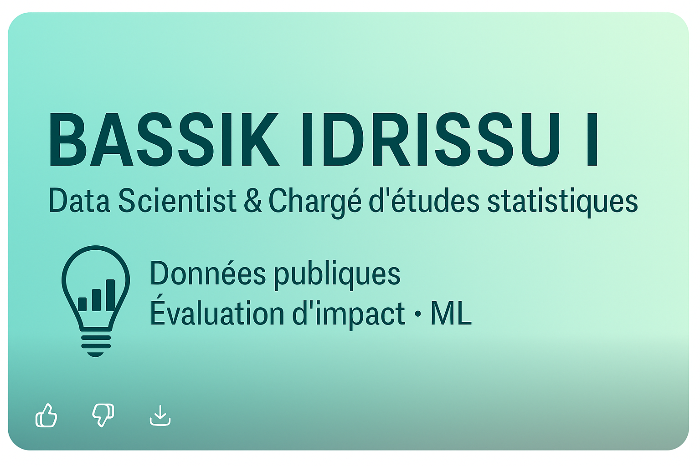

<!-- Bannière -->

  

<h1 align="center">👋 Bonjour, je suis <strong>Bassik IDRISSOU</strong></h1>

🎯 <strong>Chargé d’études statistiques & Data Analyst</strong>  
 
📍 Vélizy-Villacoublay, France  
 
💡 Données publiques | Modélisation | Évaluation d’impact | Machine Learning  

---

<!-- Badges -->

  
  
  
  
  
  

---

## 🧭 À propos de moi  

Passionné par l’usage des données pour **comprendre, évaluer et améliorer les politiques publiques**, j’ai développé une expertise en **analyse statistique**, **modélisation prédictive** et **évaluation d’impact**.  

Mon approche combine :  
- la **rigueur scientifique** issue de la recherche académique,  
- la **curiosité d’un data scientist**,  
- et la **volonté d’agir** sur des problématiques sociales concrètes.  

🎯 *J’aime transformer les données en leviers d’action – pour que les analyses deviennent des outils d’aide à la décision.*

---

## 🧮 Compétences clés  

| Domaine | Compétences |
|:--|:--|
| **Langages** | R, Python, SAS, SQL |
| **Machine Learning** | Régression, Random Forest, k-means, Séries temporelles, PSM, IPTW, Prophet |
| **Outils / Environnements** | Jupyter, Power BI, Power Query, Scikit-learn, Oracle, LimeSurvey |
| **Visualisation & Reporting** | ggplot2, Power BI, tableaux de bord automatisés, reporting dynamique |
| **Statistique appliquée** | Inférence, économétrie, évaluation d’impact, data mining |
| **Méthodes mixtes** | Analyses quantitatives et qualitatives, évaluation participative |

---

## 🚀 Projets phares  

### 🌍 [Analyse temporelle et prédictive de la qualité de l’air en Inde (2015–2020)](https://github.com/Bassik30/Air_quality_forecast_india_AQI)
Étude complète de la pollution atmosphérique dans dix grandes villes indiennes à partir des données publiques du *Central Pollution Control Board (CPCB)*.  
- **Objectif :** analyser les tendances spatio-temporelles et prédire la qualité de l’air (AQI)  
- **Méthodes :** Random Forest ($R^2 = 0.90$) & Prophet (prévision 2028), visualisation géographique (Folium)  
- **Résultats :** Delhi, Kolkata et Guwahati parmi les plus polluées ; tendance légèrement baissière après 2020  
📘 *[Rapport complet (PDF)](https://github.com/Bassik30/Air_quality_forecast_india_AQI/blob/main/docs/rapport_AQI_Inde.pdf)*  

---

### 📊 [Analyse des données de l’Observatoire de la Vie Étudiante (OVE)](https://github.com/Bassik30/student_mental_health_OVE)
Exploration de plus de 46 000 observations issues des enquêtes nationales de l’OVE (2016 & 2020).  
- **Objectif :** identifier les facteurs du mal-être étudiant et construire des modèles prédictifs  
- **Méthodes :** régressions multiples, Random Forest, k-means  
- **Résultats :** identification des profils étudiants les plus vulnérables et des déterminants socio-économiques du bien-être  

---

## 📈 Mes statistiques GitHub  

  
  

---

## 🎓 Formation  

🎓 **Master Économie Appliquée – Évaluation des politiques publiques & Data Science**  
Université de Poitiers (2023–2025)  

🎓 **Maîtrise Sciences Économiques – Ingénierie économique**  
Université de Besançon (2022–2023)  

---

## 💬 Soft skills  

💡 Esprit d’analyse et rigueur scientifique  
🤝 Travail collaboratif et coordination d’équipe  
🧭 Sens de la pédagogie et vulgarisation  
🚀 Proactivité : conception d’outils d’évaluation & automatisation Power BI  

---

## 📫 Me contacter  

  📧 <a href="mailto:idrissoubassit@gmail.com">idrissoubassit@gmail.com</a>  
   
  🔗 <a href="https://www.linkedin.com/in/abdoul-bassik-idrissou-993298222/">LinkedIn – Abdoul Bassik IDRISSOU</a>  
   
  📞 06 18 75 95 48

---

  <em>"Les données ne valent que si elles guident l’action." – Bassik IDRISSOU</em>  
   
  🗓️ Dernière mise à jour : novembre 2025

